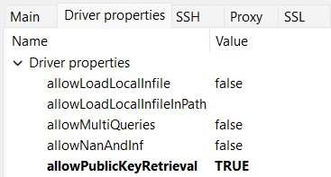

# encounterhandlerpf2e
Encounter Handler for TTRPG system Pathfinder 2e  

This is done as a training exercise.  
System logic will be based on: https://2e.aonprd.com/  
Using MySQL database, but maybe will migrate to MongoDB later on.  

# How to set up locally:
1. Download https://github.com/PawelBuczek/encounter-handler-pf2e-back (this repo)  
   and https://github.com/PawelBuczek/encounter-handler-pf2e-front (front-end part)
2. For setup of `encounter-handler-pf2e-front` please refer to README in that repository
3. For now the only external dependency is mysql database.  
   You may install it locally if you want to, matching it with src/main/resources/application.properties file.  
   But it's easier with docker:  
   - install rancher desktop or docker desktop or any other docker tool that you like
   - download mysql image with command `docker pull mysql`  
     if you want, you can read more about this image on https://hub.docker.com/_/mysql
   - now we need to run this image in a container. You can do it yourself if you want to, but...  
     you can also run bash script `docker-images-setup.sh` for that, it is in repository root of this project
4. Run `src/main/java/com/pbuczek/pf/Application.java` *(database structure will be created by Liquibase)*

# DBeaver (or other db management tool) connection properties to connect with mysql server:
*(if you changed setup of db, please adjust below values accordingly)*  
`Server Host: 127.0.0.1`  `Port: 3306`  `Username: root`  `Password: PASSWORD`  `Driver name: MySQL`  
leave `Database` blank  
in Driver properties change `allowPublicKeyRetrieval` to `TRUE`. Below screenshot from DBeaver:  

